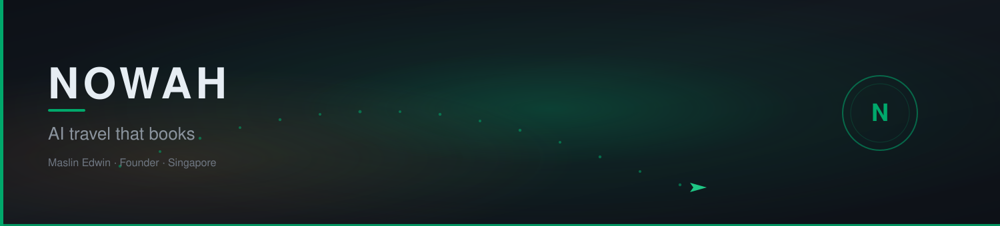
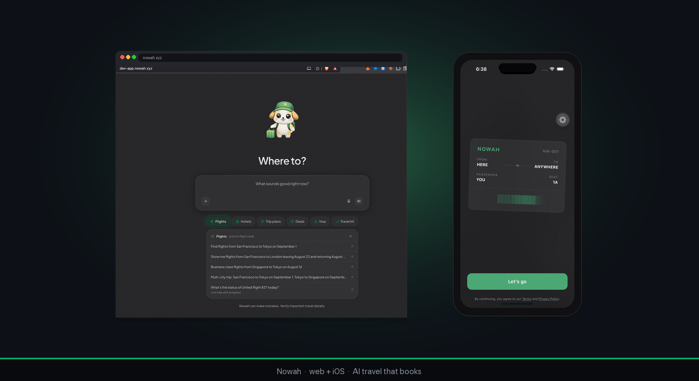

<!--
  github.com/maslinedwin — product-first founder Overview
  Design system: Nowah jade #00A86B · charcoal · dual-theme headers
  Monthly: update Now + Recently shipped only.
  Never: badge walls, stats widgets, snakes, trophies, star-cosplay pins.
-->

  <picture>
    <source media="(prefers-color-scheme: dark)" srcset="./assets/header-dark.svg" />
    <source media="(prefers-color-scheme: light)" srcset="./assets/header-light.svg" />
    
  </picture>

 

**Maslin Edwin**  
Founder of [**Nowah**](https://nowah.xyz) — AI travel that books  
Singapore

 

[`nowah.xyz`](https://nowah.xyz)&nbsp;&nbsp;·&nbsp;&nbsp;[`@maslinedwin`](https://x.com/maslinedwin)&nbsp;&nbsp;·&nbsp;&nbsp;[`maslin@nowah.xyz`](mailto:maslin@nowah.xyz)

 

### Building

I build **[Nowah](https://nowah.xyz)** — AI travel that books flights, eSIMs, and the boring middle so trips actually start.

Days look like iOS + web product work, booking reliability, payments, and the APIs that make agents useful for real travel — not demos.

> *Shipping things I care about. Less talk, more code.*

 

  
   
  Nowah · web + iOS · book the trip, not the tabs

 

  
  &nbsp;&nbsp;&nbsp;
  

 

<table>
  <tr>
    <td width="28%"><strong><a href="https://nowah.xyz">Nowah</a></strong></td>
    <td>Product — AI travel that books (flights, eSIM, the messy middle)</td>
  </tr>
  <tr>
    <td><strong><a href="https://github.com/Nowah-xyz/nowah-mcp-server">nowah-mcp-server</a></strong></td>
    <td>MCP server for assistants — flights, hotels, visas, live status</td>
  </tr>
  <tr>
    <td><strong><a href="https://github.com/Nowah-xyz/nowah-go-sdk">nowah-go-sdk</a></strong></td>
    <td>Official Go client for the Nowah Travel API</td>
  </tr>
  <tr>
    <td><strong><a href="https://github.com/Nowah-xyz/nowah-java-sdk">nowah-java-sdk</a></strong></td>
    <td>Official Java client for the Nowah Travel API</td>
  </tr>
</table>

### Now

- Shipping the full loop: **search → choose → pay → trip**, including eSIM install
- Hardening public **MCP + SDKs** so partners ride the same rails we do
- Building in public where it helps — private where the product needs to

### Recently shipped

| When | What |
|------|------|
| 2026 | Public [MCP server](https://github.com/Nowah-xyz/nowah-mcp-server) for travel agents & assistants |
| 2026 | [Go](https://github.com/Nowah-xyz/nowah-go-sdk) & [Java](https://github.com/Nowah-xyz/nowah-java-sdk) Travel API SDKs |
| 2026 | Nowah **web + iOS** product surfaces (chat booking, onboarding, flights) |

### Tools I use to build Nowah

  

| Surface | Stack |
|---------|--------|
| Mobile | React Native · Expo · TypeScript |
| Web & APIs | Next.js · Node · PostgreSQL · Prisma |
| Agents | Model APIs · MCP · Nowah travel tools |
| Money & infra | Stripe · AWS · Docker |

<strong>Fuller list</strong>

 

`TypeScript` `React Native` `Expo` `Next.js` `Node` `PostgreSQL` `Redis` `Prisma` `AWS` `Docker` `Stripe` · model APIs as needed

### Reach

<table>
  <tr>
    <td>Product</td>
    <td><a href="https://nowah.xyz">nowah.xyz</a></td>
  </tr>
  <tr>
    <td>Email</td>
    <td><a href="mailto:maslin@nowah.xyz">maslin@nowah.xyz</a></td>
  </tr>
  <tr>
    <td>X</td>
    <td><a href="https://x.com/maslinedwin">@maslinedwin</a></td>
  </tr>
</table>

If you’re building travel infrastructure, agent tooling, or want to collaborate — say hello.

---

  Still shipping. The hard parts didn’t get easier — I got more patient.

