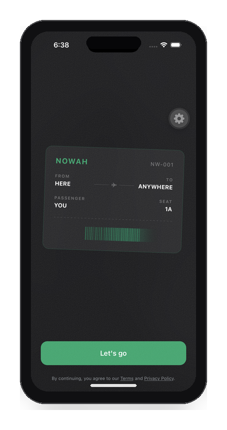
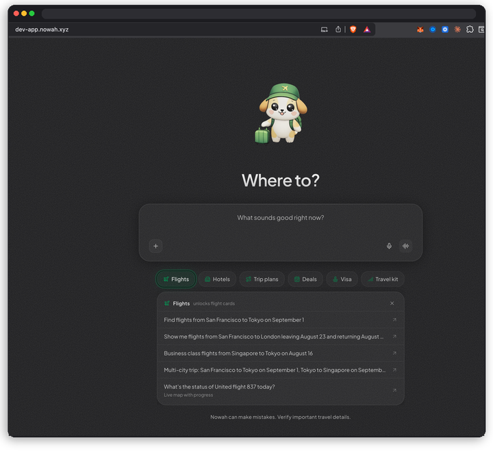

<!--
  Profile README — keep it quiet, product-first, maintainable.
  Monthly: refresh ## Now and ## Recently shipped only.
  Do not reintroduce badge walls, stats widgets, snakes, or trophy rows.
-->

  <picture>
    <source media="(prefers-color-scheme: dark)" srcset="assets/banner-dark.png" />
    <source media="(prefers-color-scheme: light)" srcset="assets/banner-light.png" />
    
  </picture>

  <strong>Maslin Edwin</strong> 
  Founder of <a href="https://nowah.xyz">Nowah</a> — AI travel that books 
  Singapore

  <a href="https://nowah.xyz">nowah.xyz</a> ·
  <a href="https://x.com/maslinedwin">@maslinedwin</a> ·
  <a href="mailto:maslin@nowah.xyz">maslin@nowah.xyz</a>

---

I build **[Nowah](https://nowah.xyz)** — AI travel that books flights, eSIMs, and the boring bits so trips start sooner.

Most days I’m in the product: iOS, web, booking flows, and the APIs that make agents useful for real travel — not demos.

> Shipping things I care about. Less talk, more code.

  
  &nbsp;&nbsp;
  

Nowah — book the trip, not the tabs

## Start here

1. **[Nowah](https://nowah.xyz)** — product (AI travel that books)
2. **[nowah-mcp-server](https://github.com/Nowah-xyz/nowah-mcp-server)** — travel tools for AI assistants (flights, hotels, visas, live status)
3. **[nowah-go-sdk](https://github.com/Nowah-xyz/nowah-go-sdk)** — official Go client for the Nowah Travel API
4. **[nowah-java-sdk](https://github.com/Nowah-xyz/nowah-java-sdk)** — official Java client

## Now

- Shipping Nowah end-to-end: search → choose → pay → trip, including eSIM
- Hardening public MCP + SDKs so partners can use the same rails we do
- Still building in public where it helps — core app work stays private when it should

## Recently shipped

- **2026** — Public [Nowah MCP server](https://github.com/Nowah-xyz/nowah-mcp-server) for assistants and agents
- **2026** — [Go](https://github.com/Nowah-xyz/nowah-go-sdk) & [Java](https://github.com/Nowah-xyz/nowah-java-sdk) SDKs for the Travel API
- **2026** — Nowah web + iOS product loops (flights, chat booking, onboarding)

## Tools I use to build Nowah

| Surface | Stack |
|---------|--------|
| Mobile | React Native / Expo, TypeScript |
| Product web & APIs | TypeScript, Node, PostgreSQL |
| AI / agents | Model APIs, MCP, own travel tools |
| Infra & payments | AWS, Docker, Stripe |

Fuller list

TypeScript · React Native · Expo · Next.js · Node · PostgreSQL · Redis · Prisma · AWS · Docker · Stripe · Claude / OpenAI-class APIs as needed

## Reach

- Product: [nowah.xyz](https://nowah.xyz)
- Email: [maslin@nowah.xyz](mailto:maslin@nowah.xyz)
- X: [@maslinedwin](https://x.com/maslinedwin)

If you’re building travel infrastructure, agent tooling, or want to collaborate — say hello.
