<div align="center">

<!-- Animated Header with Starfield Background -->


<!-- Profile Views and Visitor Counter -->
<p align="center">
  
  
  
</p>

<!-- Animated Social Links with Pulse Effect -->
<p align="center">
  <a href="https://donatuz.org">
    
  </a>
  <a href="https://twitter.com/maslinedwin">
    
  </a>
  <a href="https://t.me/maslinedwin">
    
  </a>
  <a href="mailto:maslin@donatuz.com">
    
  </a>
</p>

</div>

<!-- Animated CSS Section -->
<div align="center">
  
</div>

<!-- Enhanced About Me Section with Professional Layout & Visual Polish -->
<div align="center">
  
</div>

## <div align="center"> About Me</div>

<!-- Dynamic Typing Animation -->
<div align="center">
  
</div>

<!-- Main Profile Card with Visual Enhancement -->
<div align="center">
  <table style="border: none;">
    <tr>
      <td align="center" width="40%">
        
        <br/>
        <div style="margin-top: 15px;">
          
        </div>
      </td>
      <td align="center" width="60%">
        <h2>🚀 Founder · Product Apostle · Code × Faith</h2>
        <br/>
        
        <!-- Quick Stats Cards -->
        <table>
          <tr>
            <td align="center" width="50%">
              
              <br/><br/>
              
            </td>
            <td align="center" width="50%">
              
              <br/><br/>
              
            </td>
          </tr>
        </table>
      </td>
    </tr>
  </table>
</div>

<!-- Visual Separator with Gradient -->
<div align="center">
  
</div>

<!-- Mission & Vision Cards with Enhanced Design -->
<div align="center">
  <h3>
     
    Mission & Core Values
  </h3>
</div>

<table align="center" style="margin: 20px 0;">
  <tr>
    <td align="center" width="33%" style="padding: 15px;">
      <div style="background: linear-gradient(135deg, #667eea 0%, #764ba2 100%); padding: 20px; border-radius: 15px; margin: 10px;">
        <h4 style="color: white;">🌟 Primary Mission</h4>
        
        <p style="color: white; font-style: italic; margin-top: 10px;">"Democratizing creator monetization worldwide"</p>
      </div>
    </td>
    <td align="center" width="33%" style="padding: 15px;">
      <div style="background: linear-gradient(135deg, #f093fb 0%, #f5576c 100%); padding: 20px; border-radius: 15px; margin: 10px;">
        <h4 style="color: white;">🙏 Core Values</h4>
        
        <p style="color: white; font-style: italic; margin-top: 10px;">"Technology with purpose and meaning"</p>
      </div>
    </td>
    <td align="center" width="33%" style="padding: 15px;">
      <div style="background: linear-gradient(135deg, #4facfe 0%, #00f2fe 100%); padding: 20px; border-radius: 15px; margin: 10px;">
        <h4 style="color: white;">⚡ Vision</h4>
        
        <p style="color: white; font-style: italic; margin-top: 10px;">"Transparent, blockchain-powered future"</p>
      </div>
    </td>
  </tr>
</table>

<!-- Tech Stack Arsenal with Enhanced Visuals -->
<div align="center">
  
  
  <h3>
     
    Tech Stack Arsenal
  </h3>
</div>

<details open>
<summary><b>🚀 Click to explore my complete technology stack</b></summary>

<br/>

<table align="center" style="border-spacing: 15px;">
  <tr>
    <td align="center" width="25%" style="background: rgba(157, 78, 221, 0.1); padding: 20px; border-radius: 15px; border: 2px solid #9D4EDD;">
      <h4>💻 Languages</h4>
      
      <br/><br/>
      <div>
        
        
        <br/>
        
        
      </div>
    </td>
    <td align="center" width="25%" style="background: rgba(255, 105, 180, 0.1); padding: 20px; border-radius: 15px; border: 2px solid #FF69B4;">
      <h4>🎨 Frontend</h4>
      
      <br/><br/>
      <div>
        
        
        <br/>
        
        
      </div>
    </td>
    <td align="center" width="25%" style="background: rgba(0, 212, 255, 0.1); padding: 20px; border-radius: 15px; border: 2px solid #00D4FF;">
      <h4>⚙️ Backend</h4>
      
      <br/><br/>
      <div>
        
        
        <br/>
        
        
      </div>
    </td>
    <td align="center" width="25%" style="background: rgba(255, 215, 0, 0.1); padding: 20px; border-radius: 15px; border: 2px solid #FFD700;">
      <h4>☁️ Cloud & Web3</h4>
      
      <br/><br/>
      <div>
        
        
        <br/>
        
        
      </div>
    </td>
  </tr>
</table>

</details>

<!-- Learning Journey with Progress Indicators -->
<div align="center">
  
  
  <h3>
     
    Current Learning Journey
  </h3>
</div>

<div align="center">
  <table>
    <tr>
      <td align="center" width="33%">
        <div style="background: linear-gradient(45deg, #DE3C24, #FF6B35); padding: 15px; border-radius: 12px; margin: 10px;">
          <h4 style="color: white;">🦀 Rust</h4>
          
          <p style="color: white; font-size: 12px; margin-top: 8px;">Systems Programming</p>
        </div>
      </td>
      <td align="center" width="33%">
        <div style="background: linear-gradient(45deg, #4285F4, #34A853); padding: 15px; border-radius: 12px; margin: 10px;">
          <h4 style="color: white;">🤖 Machine Learning</h4>
          
          <p style="color: white; font-size: 12px; margin-top: 8px;">AI Integration</p>
        </div>
      </td>
      <td align="center" width="33%">
        <div style="background: linear-gradient(45deg, #9D4EDD, #FF69B4); padding: 15px; border-radius: 12px; margin: 10px;">
          <h4 style="color: white;">🏦 DeFi Protocols</h4>
          
          <p style="color: white; font-size: 12px; margin-top: 8px;">Blockchain Finance</p>
        </div>
      </td>
    </tr>
  </table>
</div>

<!-- Fun Fact Section with Enhanced Styling -->
<div align="center">
  
  
  <h3>
     
    Fun Development Facts
  </h3>
  
  <div style="background: linear-gradient(135deg, #667eea 0%, #764ba2 100%); padding: 25px; border-radius: 20px; margin: 20px auto; max-width: 600px; border: 3px solid #9D4EDD;">
    
    <br/><br/>
    <p style="color: white; font-style: italic; font-size: 16px;">
      <strong>"When faith meets code, miracles happen in the terminal"</strong>
    </p>
    <br/>
    <div>
      
      
      
    </div>
  </div>
</div>

<!-- Faith & Code Philosophy with Interactive Element -->
<div align="center">
  

  <details>
  <summary><b>✨ Faith × Code Philosophy (Click to explore deeper)</b></summary>
  
  <br/>
  
  <table align="center" style="border: 2px solid #9D4EDD; border-radius: 15px; background: linear-gradient(135deg, rgba(157, 78, 221, 0.1) 0%, rgba(255, 105, 180, 0.1) 100%);">
    <tr>
      <td align="center" style="padding: 30px;">
        <h3>🎯 Core Development Principles</h3>
        <div style="text-align: left; max-width: 500px; margin: 0 auto;">
          <p>✨ <strong>Code with Purpose:</strong> Every function serves a greater mission</p>
          <p>🙏 <strong>Faith-Guided Vision:</strong> Divine inspiration meets technical execution</p>
          <p>⚡ <strong>Empower Through Technology:</strong> Build tools that uplift creators</p>
          <p>🚀 <strong>Excellence in Execution:</strong> Quality through dedication and prayer</p>
        </div>
        <br/>
        <h4>📅 Daily Development Rhythm</h4>
        <table align="center" style="margin-top: 15px;">
          <tr>
            <td align="center" width="33%">
              <div style="background: rgba(255, 215, 0, 0.2); padding: 15px; border-radius: 10px;">
                <strong>🌅 Morning</strong><br/>
                <small>Prayer + Coffee + Code Review</small>
              </div>
            </td>
            <td align="center" width="33%">
              <div style="background: rgba(157, 78, 221, 0.2); padding: 15px; border-radius: 10px;">
                <strong>💻 Deep Work</strong><br/>
                <small>Focus Blocks + Worship Music</small>
              </div>
            </td>
            <td align="center" width="33%">
              <div style="background: rgba(255, 105, 180, 0.2); padding: 15px; border-radius: 10px;">
                <strong>🌙 Evening</strong><br/>
                <small>Reflection + Planning + Gratitude</small>
              </div>
            </td>
          </tr>
        </table>
        <br/>
        <blockquote style="font-style: italic; color: #666; border-left: 4px solid #9D4EDD; padding-left: 20px; margin: 20px 0;">
          "Every line of code is an opportunity to serve others and build something meaningful. Through faith-driven development, we create technology that empowers and uplifts the creator community."
        </blockquote>
      </td>
    </tr>
  </table>
  
  </details>
</div>

<!-- Section Footer with Breathing Room -->
<div align="center">
  
</div>

<br/>

##  Mission & Vision

<div align="center">

<!-- Mission Cards -->
<table>
  <tr>
    <td align="center" width="33%">
      <div>
        
        <br/><br/>
        <h3>🚀 Primary Mission</h3>
        <p><strong>"Empowering creators globally"</strong></p>
        <p><em>Breaking barriers, building bridges for creative minds everywhere</em></p>
      </div>
    </td>
    <td align="center" width="33%">
      <div>
        
        <br/><br/>
        <h3>✨ Core Values</h3>
        <p><strong>"Building with faith & code"</strong></p>
        <p><em>Where divine inspiration meets technical innovation</em></p>
      </div>
    </td>
    <td align="center" width="33%">
      <div>
        
        <br/><br/>
        <h3>🔮 Vision</h3>
        <p><strong>"Revolutionizing creator economy through technology ⚡"</strong></p>
        <p><em>Reshaping how creators connect, create, and thrive</em></p>
      </div>
    </td>
  </tr>
</table>

<!-- Visual Separators & Impact Badges -->
<br/>

<div align="center">
  
  
  
</div>

<br/>

<!-- Inspirational Quote Card -->
<div align="center">
  
</div>

</div>

<div align="center">
  
</div>

##  What I'm Building

<div align="center">
  <a href="https://donatuz.org">
    
  </a>
  <br/>
  <a href="https://github.com/donatuzlabs">
    
  </a>
</div>

### 🚀 Donatuz - The Future of Creator Monetization

<details>
<summary><b>🎯 Click to explore the mission</b></summary>

<br/>

> **"Empowering creators to monetize their passion without the middleman"**

<table>
  <tr>
    <td width="50%">
      <h3>🌟 Features</h3>
      <ul>
        <li>✨ Direct creator-to-fan transactions</li>
        <li>🔐 Blockchain-powered transparency</li>
        <li>💰 Multiple monetization streams</li>
        <li>📊 Real-time analytics dashboard</li>
        <li>🌍 Global payment support</li>
      </ul>
    </td>
    <td width="50%">
      <h3>🛠️ Tech Stack</h3>
      <ul>
        <li>⚛️ Next.js 14 + TypeScript</li>
        <li>🎨 TailwindCSS + Framer Motion</li>
        <li>🔗 Ethereum Smart Contracts</li>
        <li>🚀 Vercel Edge Functions</li>
        <li>📊 PostgreSQL + Prisma</li>
      </ul>
    </td>
  </tr>
</table>

</details>

##  GitHub Stats

<div align="center">
   
  
</div>

<div align="center">
  
</div>

##  Tech Arsenal

<div align="center">

<!-- Skillicons.dev Integration -->
<p>
  
</p>

<!-- Advanced Tech Stack Grid -->
<table align="center">
  <tr>
    <td align="center" width="25%">
      <h3>🚀 <b>Languages</b></h3>
      
      <br/><br/>
      
      <br/>
      
      <br/>
      
      <br/>
      
    </td>
    <td align="center" width="25%">
      <h3>⚛️ <b>Frontend</b></h3>
      
      <br/><br/>
      
      <br/>
      
      <br/>
      
      <br/>
      
    </td>
    <td align="center" width="25%">
      <h3>🔧 <b>Backend</b></h3>
      
      <br/><br/>
      
      <br/>
      
      <br/>
      
      <br/>
      
    </td>
    <td align="center" width="25%">
      <h3>☁️ <b>Cloud & DevOps</b></h3>
      
      <br/><br/>
      
      <br/>
      
      <br/>
      
      <br/>
      
    </td>
  </tr>
</table>

<!-- Blockchain & Web3 Special Section -->
<div align="center">
  <h3>⛓️ <b>Blockchain & Web3</b></h3>
  
  
  
  
  
  <br/><br/>
  
  
</div>

<!-- Visual Tech Proficiency Chart -->
<div align="center">
  <h3>📊 <b>Proficiency Overview</b></h3>
  
</div>

<!-- Mobile Responsive Grid Alternative -->
<details>
<summary><b>📱 View Mobile-Optimized Tech Stack</b></summary>
<br/>

| Category | Technologies | Proficiency |
|----------|-------------|-------------|
| **🚀 Languages** | TypeScript, JavaScript, Python, Solidity |     |
| **⚛️ Frontend** | React, Next.js, TailwindCSS, Framer Motion |     |
| **🔧 Backend** | Node.js, Express, GraphQL, PostgreSQL |     |
| **⛓️ Blockchain** | Ethereum, Smart Contracts, Web3.js |    |
| **☁️ Cloud** | AWS, Vercel, Docker, Kubernetes |     |

</details>

<!-- Interactive Tech Stack Showcase -->
<div align="center">
  
  
  
</div>

</div>

##  Learning Journey 2024

<div align="center">

### 🎯 Currently Mastering

<table>
  <tr>
    <td align="center" width="33%">
      
      <br/>
      
      <br/>
      <sub><b>Systems Programming</b></sub>
      <br/>
      <sub>Building high-performance backends</sub>
    </td>
    <td align="center" width="33%">
      
      <br/>
      
      <br/>
      <sub><b>Machine Learning</b></sub>
      <br/>
      <sub>AI-powered creator tools</sub>
    </td>
    <td align="center" width="33%">
      
      <br/>
      
      <br/>
      <sub><b>DeFi Protocols</b></sub>
      <br/>
      <sub>Decentralized finance systems</sub>
    </td>
  </tr>
</table>

### 📚 Learning Roadmap

```mermaid
graph LR
    A[🦀 Rust Fundamentals] --> B[⚡ Performance Optimization]
    C[🤖 ML Basics] --> D[🧠 Deep Learning]
    E[💎 DeFi Concepts] --> F[🔗 Protocol Development]
    
    B --> G[🚀 Production Systems]
    D --> H[🎯 Creator AI Tools]
    F --> I[💰 Advanced DeFi]
    
    G & H & I --> J[🌟 Next Level Innovation]
```



### 🎓 Learning Stats

<div align="center">
  
  
  
  
</div>

### 🏆 Learning Achievements

<details>
<summary><b>🔓 Click to unlock my learning achievements</b></summary>

<br/>

| Achievement | Status | Date | Description |
|-------------|--------|------|-------------|
| 🦀 **Rust Beginner** | ✅ Completed | Jan '24 | Mastered ownership, borrowing, and lifetimes |
| 🤖 **ML Fundamentals** | ✅ Completed | Feb '24 | Linear regression, classification, neural networks |
| 💎 **DeFi Basics** | 🔄 In Progress | Mar '24 | AMMs, liquidity pools, yield farming |
| ⚡ **Advanced Rust** | 🔄 In Progress | Current | Async programming, macros, unsafe code |
| 🧠 **Deep Learning** | 📅 Planned | Q2 '24 | CNNs, RNNs, transformers for creator tools |
| 🔗 **Smart Contract Auditing** | 📅 Planned | Q3 '24 | Security patterns, common vulnerabilities |

</details>

</div>

##  Fun Facts & Personality

<div align="center">

### 🎵 The Coding Soundtrack

<table>
  <tr>
    <td align="center" width="100%">
      
      <br/>
      <sub><i>"There's something about praise music that unlocks creative flow and divine inspiration in coding"</i></sub>
      <br/><br/>
      
      
      
    </td>
  </tr>
</table>

### 🔥 Quirky Developer Habits

<div align="left">

| 🎯 Habit | 📊 Frequency | 💡 Impact |
|----------|-------------|-----------|
| 🙏 **Prayer before coding sessions** | Daily | Clarity & Purpose |
| ☕ **Coffee ritual (Ethiopian blend)** | 3x/day | Energy & Focus |
| 🎵 **Worship music coding** | 95% of time | Creative Flow |
| 📖 **Bible verse of the day** | Morning | Wisdom & Perspective |
| 🌅 **5 AM coding sessions** | 5x/week | Peak Productivity |
| 🔥 **"This bitch slaps" when code works** | Too often | Pure Joy |

</div>

### 🎨 Personal Coding Style

```javascript
const myStyle = {
    philosophy: "Faith-driven, purpose-built, people-focused",
    approach: "Clean code that tells a story",
    superpower: "Turning complex problems into simple solutions",
    
    codingTime: {
        peak: "5:00 AM - 9:00 AM (Golden Hours)",
        flow: "2:00 PM - 6:00 PM (Deep Work)",
        creative: "8:00 PM - 11:00 PM (Innovation Time)"
    },
    
    environment: {
        music: "🎵 Worship & Instrumental",
        drink: "☕ Ethiopian Coffee",
        mood: "🔥 Passionate & Purposeful",
        mantra: "Building tools that empower others"
    },
    
    debugging: {
        method: "Rubber duck + Prayer",
        success_phrase: "This bitch slaps! 🔥",
        celebration: "Gratitude + Coffee + Next Challenge"
    }
};
```

### 🌟 Faith & Code Integration

<div align="center">
  
  
  
</div>

<br/>

> *"Every line of code is an opportunity to serve, every bug fix is a lesson in perseverance, and every feature is a chance to empower someone else's dream."*

</div>

##  Connect & Collaborate

<div align="center">
  <a href="https://twitter.com/maslinedwin">
    
  </a>
  <a href="https://linkedin.com/in/maslinedwin">
    
  </a>
  <a href="https://t.me/maslinedwin">
    
  </a>
  <a href="mailto:maslin@donatuz.com">
    
  </a>
</div>

##  Recent Activity

<!--START_SECTION:activity-->
🚀 Building Donatuz creator monetization platform  
💻 Optimizing full-stack architecture with Next.js & Node.js  
⚡ Implementing blockchain integrations for transparent transactions  
🔧 Enhancing user experience and platform performance  
🙏 Daily coding with faith-driven purpose  
<!--END_SECTION:activity-->

## 🎯 2024 Goals

- [ ] 🚀 Launch Donatuz MVP
- [ ] 📈 Onboard 1000+ creators
- [ ] 🌍 Expand to 50+ countries
- [ ] 💰 Process $1M+ in creator transactions
- [ ] 🤝 Build partnerships with major platforms
- [ ] 📚 Open source key components

## 💭 Daily Affirmation

<div align="center">
  
</div>


<!-- Snake Animation -->
<div align="center">
  
</div>

<!-- Footer -->
<div align="center">
  
</div>


<!-- Auto-updating badges for live metrics -->
<div align="center">
  
  
  
</div>

<br/>

<!-- Live Coding Activity -->
<div align="center">
  <a href="https://github.com/donatuzlabs">
    
  </a>
  <br/>
  
</div>

<!-- WakaTime Stats -->
<div align="center">
  
</div>

<!-- Productivity Metrics -->
##  Productivity Metrics

<div align="center">
  
  
  
  
</div>


<!-- Support Section -->
##  Support the Mission

<div align="center">
  <a href="https://donatuz.org/support">
    
  </a>
  <a href="https://github.com/maslinedwin/donatuz">
    
  </a>
  <a href="https://twitter.com/intent/follow?screen_name=maslinedwin">
    
  </a>
</div>

<!-- Interactive Elements -->
<details>
<summary><b>🎯 Click to see my coding philosophy</b></summary>

<br/>

```javascript
const codingPhilosophy = {
    principles: [
        "Code with purpose, build with passion",
        "Faith guides the vision, work ethic delivers",
        "Every line of code should empower someone",
        "This bitch slaps through pure dedication"
    ],
    
    dailyPractice: {
        morning: "Prayer + Coffee + Code review",
        coding: "Deep focus blocks with worship music",
        evening: "Reflection + Planning + Gratitude"
    },
    
    mission: "Empowering creators globally through technology",
    motivation: "Building tools that matter for people who matter"
};
```

</details>

<!-- Meta Tags for SEO -->
<!-- 
SEO Optimization:
- Title: Maslin Edwin - Founder, Product Apostle, Code × Faith
- Description: Building Donatuz - The future of creator monetization. Empowering creators globally through blockchain technology and faith-driven development.
- Keywords: Maslin Edwin, Donatuz, Creator Monetization, Blockchain, Web3, TypeScript, React, Next.js, This bitch slaps through pure work ethic
- Canonical URL: https://github.com/maslinedwin
- Open Graph Image: https://github.com/maslinedwin.png
-->